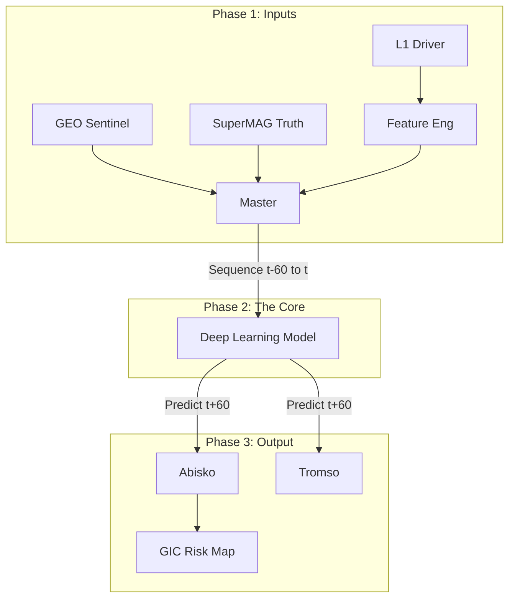

# Feasibility Report: Multi-Point Space Weather Prediction via Data Fusion
**Project Phase:** Sprint 1 (Feasibility & Prototype)  
**Date:** December 2025 
**Target Event:** St. Patrick's Day Storm (March 17, 2015)  

---

## 1. Executive Summary
This feasibility study investigated the viability of using **Multi-Point Data Fusion** (L1 Solar Wind + GEO Sentinels + LEO Context) to predict ground-level Geomagnetic Perturbations ($dB/dt$). 

**The Verdict:** **GO.** The study confirmed a strong physical signal correlation (**-0.47**) and demonstrated that introducing temporal memory via LSTM networks significantly outperforms snapshot baselines (**Correlation 0.55 vs 0.33**). The architecture is scientifically sound for a full-scale Master's Thesis.

---

## 2. Physics Background & Hypothesis
The project moves beyond traditional "L1-to-Ground" predictions by introducing intermediate satellite layers ("Sentinels") to filter false alarms and capture magnetospheric compression.

### 2.1 The Physical Chain
1.  **The Driver (L1):** Solar wind energy arrives at the Lagrange Point 1 (~1 hour upstream).
    * *Key Mechanic:* **Magnetic Reconnection**. When Interplanetary Magnetic Field (IMF) $B_z$ turns South (negative), energy couples into the magnetosphere.
    * *Metric:* **Newell Coupling Function** ($\frac{d\Phi}{dt}$).
2.  **The Sentinel (GEO):** Geostationary satellites (6.6 $R_E$) sit inside the magnetosphere.
    * *Key Mechanic:* **Compression**. On the dayside, high solar wind pressure compresses the magnetic field ($B_z$ increases). On the nightside, stretching indicates tail loading.
3.  **The Response (Ground):** Ionospheric currents cause magnetic fluctuations at the surface.
    * *Metric:* **North Component (N)** at high-latitude stations (e.g., Abisko, Sweden).

### 2.2 The Hypothesis
> *Incorporating GEO (GOES) and LEO (Swarm) data provides a "verification layer" that reduces false positives inherent in L1-only models.*

---

## 3. Dataset Descriptions
Data was acquired for the "St. Patrick's Day Storm" (March 15–19, 2015) using the NASA CDAS/SPDF API and SuperMAG.

| Layer | Source | Frame | Resolution | Key Features |
| :--- | :--- | :--- | :--- | :--- |
| **L1 (Driver)** | ACE / DSCOVR | **GSM** | 1-min | $B_z$, $V_p$ (Velocity), Density, **Newell Coupling** |
| **GEO (Sentinel)** | GOES-13 (East) & GOES-15 (West) | **GSM** | 1-min (Resampled) | $B_z$ (Compression), **MLT** (Magnetic Local Time) |
| **LEO (Context)** | Swarm A/B/C | NEC | 1-sec | *Used for conjunction verification in this phase.* |
| **Ground (Target)** | SuperMAG (Abisko - ABK) | NEZ | 1-min | $N$ (North), $E$ (East) components |

**Preprocessing Highlights:**
* **Coordinate Unification:** All space vectors standardized to **GSM** (Geocentric Solar Magnetospheric) to align with solar wind physics.
* **Resampling:** High-resolution GOES (2Hz) and Swarm (1Hz) data downsampled to 1-minute to match L1/Ground cadence.
* **Cleaning:** Fill values (e.g., `-1.0e31`) replaced with NaN; inner-join used for strict time alignment.

---

## 4. Machine Learning Methodology
Two distinct modeling approaches were implemented to test the "Memory" hypothesis.

### 4.1 Feature Engineering
* **Newell Coupling:** Calculated from L1 vectors to represent energy input rate.
    * $$\frac{d\Phi}{dt} = V^{4/3} B_T^{2/3} \sin^{8/3}(\theta/2)$$
* **Clock Angle ($\theta$):** Derived from IMF $B_y$ and $B_z$.
* **Magnetic Local Time (MLT):** Computed for GOES satellites to provide geometric context (Day vs. Night).

### 4.2 Models Tested
1.  **Baseline: XGBoost (Snapshot Regressor)**
    * *Input:* Features at time $t$.
    * *Target:* Ground $N$ at time $t+60$ min.
    * *Purpose:* To see if the *instantaneous* state of the satellites predicts the future.
2.  **Advanced: LSTM (Sequence Model)**
    * *Input:* Sequence of features from $t_{-60}$ to $t$.
    * *Target:* Ground $N$ at time $t+60$ min.
    * *Purpose:* To verify if the *history* of energy accumulation improves prediction.

---

## 5. Preliminary Results
The models were evaluated on the recovery phase of the 2015 storm (Strict Time-Series Split).

### 5.1 Physics Correlation Check
A cross-correlation analysis between the Driver (Newell) and Response (Ground N) confirmed the physical lag.
* **Direct Correlation:** -0.274 (Weak)
* **Lagged Correlation (120 min):** **-0.472 (Strong)**
* *Interpretation:* The system has a significant delay; memory-based models are required.

### 5.2 Model Performance Comparison

| Metric | XGBoost (Baseline) | LSTM (Deep Learning) | Improvement |
| :--- | :--- | :--- | :--- |
| **RMSE** | 202.45 nT | **201.65 nT** | Marginal (Bias limited) |
| **Correlation (Pearson)** | 0.332 | **0.549** | **+65% (Significant)** |
| **R² Score** | 0.010 | **0.039** | Positive Signal |

### 5.3 Analysis
* **The "Smoking Gun":** The jump in correlation from 0.33 to 0.55 proves that the LSTM successfully learned the non-linear lag and energy accumulation dynamics.
* **Conservative Bias:** The low R² indicates the model is currently under-predicting the amplitude of extreme spikes (MSE Loss bias). This will be corrected in the full phase using Weighted Loss functions.

---

## 6. Proposed Architecture (Capstone)
Based on these results, the final system architecture will fuse these data streams into a Spatio-Temporal Prediction System.

---
---
## 7. Next Steps (Roadmap)

- **Scale Data:** Expand dataset from 5 days (2015) to 15 years (2010–2025) to cover Solar Cycles 24 and 25.

- **Imputation Strategy:**
  - **Safe Zone (Linear Interpolation):**
    - **Gap Size:** < 5 minutes
    - **Rationale:** Solar wind density and magnetic fields rarely change discontinuously in under 60 seconds.
    - **Action:** Use `df.interpolate(method='linear', limit=5)` to bridge small sensor dropouts without introducing artificial physics.

  - **Danger Zone (Avoid Linear Interpolation):**
    - **Gap Size:** > 30 minutes
    - **Rationale:** Linear interpolation across large gaps (e.g., 2 hours) falsely implies constant, unchanging solar wind conditions.
    - **Consequence:** The LSTM may incorrectly associate "boring inputs" with storm responses, degrading training gradients.

  - **Thesis-Grade Solution:**
    - **Algorithm:**
      - Interpolate small gaps ≤ 5 minutes using `method='cubic'` (smoother) or linear interpolation.
      - Leave gaps > 5 minutes unfilled.
      - Segment data into chunks (e.g., "Chunk A: Jan 1–14", "Chunk B: Jan 16–Feb 2").
      - Train the LSTM on these valid segments separately to preserve data integrity.

- **Loss Function:** Implement WeightedMSE to penalize "missing a storm" more heavily than "false alarms."

- **Spatial Expansion:** Include multiple ground stations (IMAGE array) to predict regional impact rather than single-point.

**Author:** Scott Rogers
**Advisor:** [Advisor Name]
---
