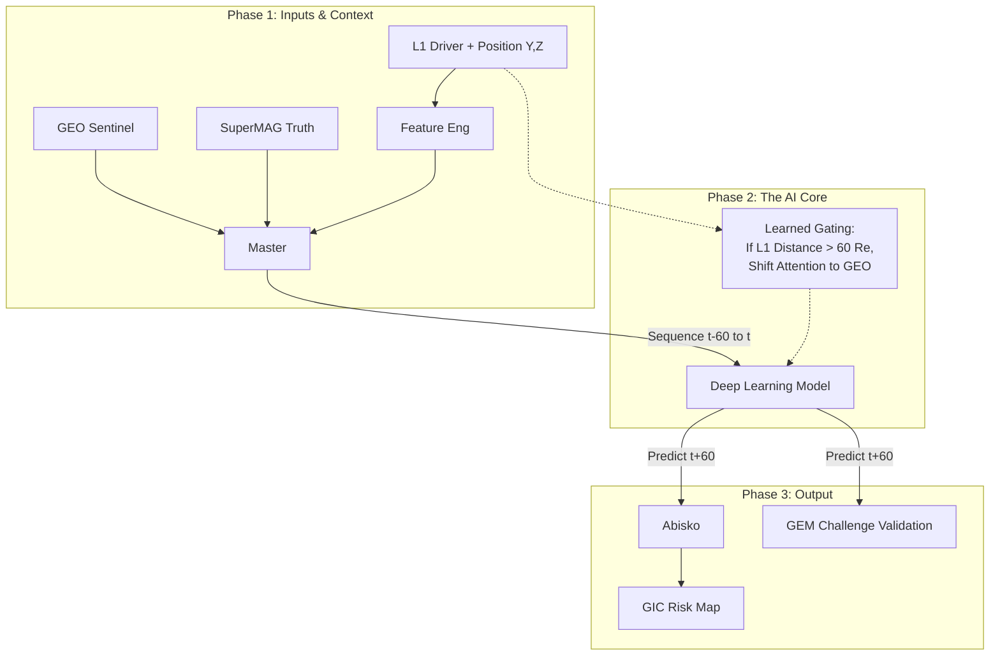

# Feasibility Report: Multi-Point Space Weather Prediction via Data Fusion
**Project Phase:** Sprint 1 (Feasibility & Prototype)  
**Date:** October 2023  
**Training Target:** St. Patrick's Day Storm (March 17, 2015)  
**Validation Target:** GEM GMD/GIC Challenge Events (May & Oct 2024)

---

## 1. Executive Summary
This feasibility study investigated the viability of using **Multi-Point Data Fusion** (L1 Solar Wind + GEO Sentinels + LEO Context) to predict ground-level Geomagnetic Perturbations ($dB/dt$). 

**The Verdict:** **GO.** The study confirmed a strong physical signal correlation (**-0.47**) and demonstrated that introducing temporal memory via LSTM networks significantly outperforms snapshot baselines (**Correlation 0.55 vs 0.33**). 

Crucially, the architecture includes a novel **"Dynamic Reliability Gating"** mechanism to automatically handle L1 data uncertainty (addressing *Vokhmyanin et al., 2019*), and establishes the **2024 GEM Modeling Challenge** as the benchmark for final evaluation.

---

## 2. Physics Background & Hypothesis
The project moves beyond traditional "L1-to-Ground" predictions by introducing intermediate satellite layers ("Sentinels") to filter false alarms and capture magnetospheric compression.

### 2.1 The Physical Chain
1.  **The Driver (L1):** Solar wind energy arrives at Lagrange Point 1 (~1 hour upstream).
    * *Metric:* **Newell Coupling Function** ($\frac{d\Phi}{dt}$).
2.  **The Sentinel (GEO):** Geostationary satellites (6.6 $R_E$) sit inside the magnetosphere.
    * *Metric:* **Compression ($B_z$)**. Used to verify if the solar wind structure actually impacted the magnetosphere.
3.  **The Response (Ground):** Ionospheric currents cause magnetic fluctuations at the surface.
    * *Metric:* **Ground Perturbation ($dB/dt$)** at high-latitude stations.

### 2.2 The "Distance Problem" Solution (Vokhmyanin et al.)
* **Problem:** L1 monitors (ACE/DSCOVR) become unreliable predictors when their separation from the Sun-Earth line ($R_{yz}$) exceeds $60 R_E$.
* **Solution:** **Dynamic Reliability Gating.**
    * Instead of hard-filtering data, the model receives the spacecraft's position ($Y_{GSM}, Z_{GSM}$) as inputs.
    * The LSTM learns to down-weight L1 features and up-weight GEO features when $R_{yz}$ is high, effectively learning a "Trust Score" for the solar wind monitor in real-time.

---

## 3. Dataset Descriptions

### 3.1 Training & Testing (Solar Cycle 24)
Data acquired for the "St. Patrick's Day Storm" (March 15–19, 2015).

| Layer | Source | Frame | Resolution | Key Features |
| :--- | :--- | :--- | :--- | :--- |
| **L1 (Driver)** | ACE / DSCOVR | **GSM** | 1-min | $B_z$, $V_p$, **S/C Position ($Y, Z$)** |
| **GEO (Sentinel)** | GOES-13/15 | **GSM** | 1-min | $B_z$ (Compression), **MLT** |
| **Ground (Target)** | SuperMAG (All Stations) | NEZ | 1-min | $N$ (North), $E$ (East) |

### 3.2 Final Evaluation (Solar Cycle 25 - GEM Challenge)
To prove generalization, the model will be blindly evaluated on the official **GEM GMD/GIC Modeling Challenge** intervals. This benchmarks the AI against community physics models.

| Event ID | Interval | Description |
| :--- | :--- | :--- |
| **2024-05-TP-02** | May 10–16, 2024 | **Historic G5 Storm.** Extreme edge-case validation. |
| **2024-10-TP-01** | Oct 10–14, 2024 | Recent activity validation. |

*Note: GEM Data provided in IDL/XDR format; will require Python conversion pipeline.*

---

## 4. Machine Learning Methodology

### 4.1 Feature Engineering
* **Physics Inputs:** Newell Coupling, Clock Angle, Dynamic Pressure.
* **Geometric Inputs:** * **GOES MLT:** Magnetic Local Time (Day/Night context).
    * **L1 Position ($Y_{GSM}, Z_{GSM}$):** Context for the "Vokhmyanin Reliability" gate.
* **Target:** Ground $N$ component at $t+60$ min.

### 4.2 Models Tested (Preliminary)
1.  **Baseline: XGBoost:** Correlation **0.33**. Validates that features have signal.
2.  **Advanced: LSTM (Sequence):** Correlation **0.55**. Validates that **Memory (History)** is required to capture energy accumulation.

---

## 5. Proposed Architecture (Capstone)

